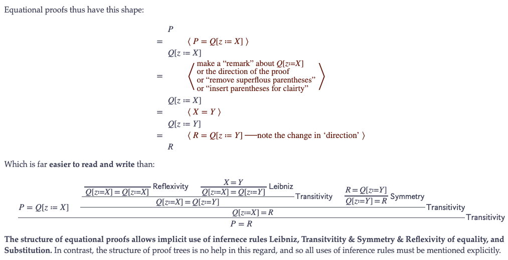

# Table of Contents

 
 <h3></h3>

<h2>

<a href="https://alhassy.github.io/CalcCheck/Docs"><code>CalcCheck</code> Documentation</a>

</h2>

 

 
 <h3></h3>

<h2>

<a href="https://alhassy.github.io/CalcCheck/LectureNotes.html">Lecture Notes</a>

</h2>

 

 
 <h3></h3>

<h2>

Videos

</h2>

1.  Introduction to Discrete & Calculational Maths ─[Wolfram](https://web.microsoftstream.com/video/76eac408-540e-47f9-a83b-d2caad93443c), [Musa](https://youtu.be/5IyMizFhHMA) Sep 8

    What is a calculational proof? What is discrete mathematics?
    How is math related to programming: “proofs-as-programs”.

2.  Grammatical Analysis and Boolean Operators ─[Wolfram](https://web.microsoftstream.com/video/3216c424-1494-4ed1-9f7d-6591bde71fc3) (only second part), [Musa](https://youtu.be/0wM0WXLJULQ)  Sep 10

    A proof is a “story”, and calculation hints are the “transitions” that make
    the story flow nicely.  The formulae are the “sentences” and they are formed
    from operators, constants, and variables which act as “verbs”, “names”, and
    “pronouns”, respectively.

    ℕumber arithmetic is learned by memorising parts of
    infinitely large addition and multiplication tables.
    In contrast, 𝔹oolean arithmetic has tiny 2×2 “truth tables”.
    As such, 𝔹  may be easier to learn than ℕ.

3.  Ladies and Tigers, a teaser ─[Wolfram](https://web.microsoftstream.com/video/3153223e-a48a-4177-bb2b-013d0694b336), [Musa](https://youtu.be/9oeJtu4JjSQ)  Sep 11

    Continuing the discussion on Boolean operators
    and how they can be used to model puzzles.

4.  Substitution ─Wolfram (not yet available), [Musa](https://youtu.be/7cmretG3Zzg)  Sep 15

    Textual substitution is a way to implement function application,
    grafting on trees, and can be used for assignment commands in programming.

5.  Inference rules, Proofs-are-programs, and Equivalence Part I ─Wolfram (not
    yet available), [Musa](https://youtu.be/OXL-FvDqhX8) Sep 17

    Update: There will be no knights and knaves problems in the upcoming Sep 22 midterm;
    but possibly in a future midterm.

    The inference rules act as the foundational justification for the equational
    proof style; the online lecture notes go into more detail.

6.  Inference rules, Proofs-are-programs, and Equivalence Part II ─Wolfram (not
    yet available), [Musa](https://youtu.be/JxRZC2UMJb0) (with lofi music) Sep 18

    Quickly show how a program can be shown to meet its specification,
    discuss equivalence and negation for the purposes of solving
    knights and knaves problems.

7.  **not yet given**

    Sep 22 is the first midterm; it is online during class time.

 

<table border="2" cellspacing="0" cellpadding="6" rules="groups" frame="hsides">

<colgroup>
<col  class="org-left" />
</colgroup>
<tbody>
<tr>
<td class="org-left">⇨ <a href="https://github.com/alhassy/CalcCheck">Github Repository</a> ⇦</td>
</tr>
</tbody>
</table>
